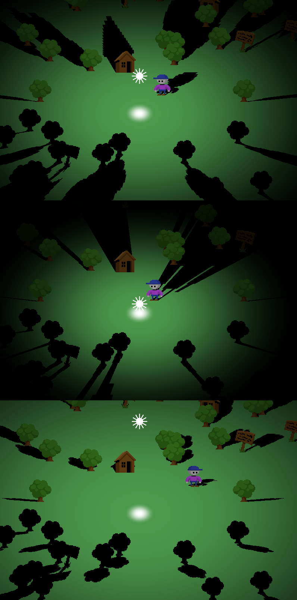

# Flat Shadows

This is an example project showing how somewhat simple shadows can be rendered in [LÖVE](https://love2d.org/).
Also featuring perspective correct texture mapping, with no 3D involved!

